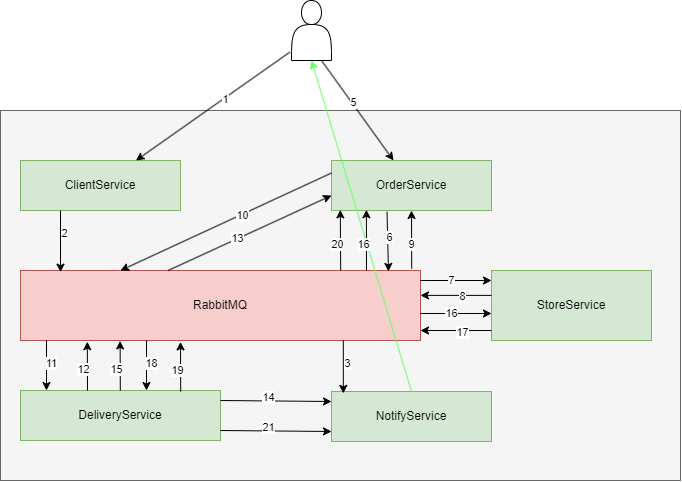
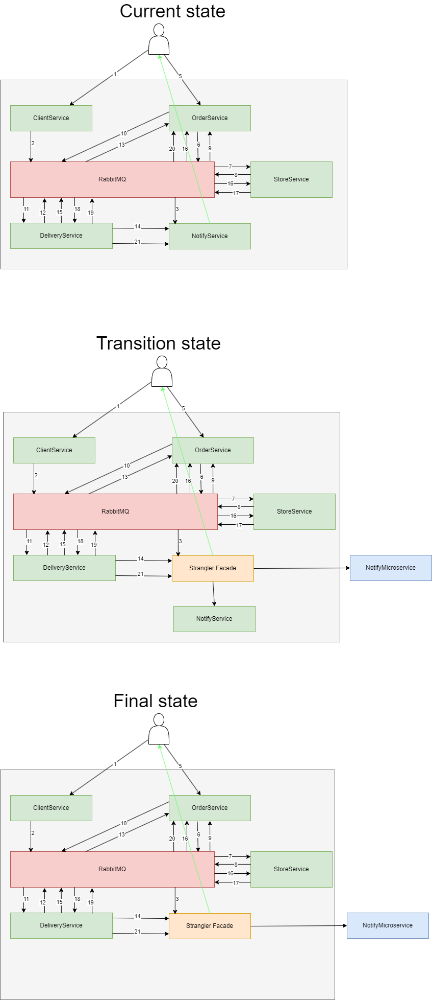

# Выделить часть функционала монолита в микросервис

## Цель:

Подготовить документ-план распила монолита на микросервисы.

## Описание/Пошаговая инструкция выполнения домашнего задания:

0. Выбрать крупную, известную вам информационную систему, в примере по
   [ссылке](https://docs.google.com/spreadsheets/d/1Y-0ExAXsmt-tyQOgjAZv43ReCvMUR5kVcpGN1ppQWGw/edit?usp=sharing)
   представлено Яндекс.Такси. Описать ее назначение и один или несколько ее бизнес процессов
1. Определить необходимые микросервисы, и их назначение (должно быть не менее 5)
2. Описать взаимодействие сервисов в рамках одного из бизнес-сценариев. Т.е. какой микросервис с кем взаимодействует,
   какие данные передает, какие ожидает и способ взаимодействия (синхронно (какая технология?) или асинхронно (какая
   технология?)) Например, при запросе от пользователя нам необходимо: проверить не исключен ли он, затем построить
   маршрут на основе маршрута у тарификатора получить данные о стоимости и
   т.д.
3. Использовать паттерн strangler для одного из микросервисов

<b>Критерии оценки:</b> 
+1 балл за выполнения пункта 0 
+3 балла за выполнения пункта 1 
+3 балла за выполнения пункта 2 

3 балла за выполнения пункта 3 
Минимальный проходной балл: 7.

---

## Пункт 0. Лемана ПРО - продажа и доставка строительных материалов.

Лемана ПРО - продажа строительных материалов.
Включает в себя:
- продажу строительных материалов в специализированных магазинах
- продажу строительных материалов через сайт и мобильное приложение
- доставку строительных материалов на объект

---

## Пункт 1. Необходимые микросервисы, и их назначение.

1) $\color{#0f0}{\textsf{OrderService (Сервис заказов)}}$ - управление, оформление, и прослеживание статуса заказа.
2) $\color{#0f0}{\textsf{ClientService (Сервис клиентов)}}$ - управление аккаунтами клиентов, добавление, удаление, синхронизация с заказами.
3) $\color{#0f0}{\textsf{StoreService (Сервис хранения товаров)}}$ - учет товаров на складах магазинов.
4) $\color{#0f0}{\textsf{NotifyService (Сервис оповещения)}}$ - уведомление о статусе заказаза, рекламные рассылки. 
5) $\color{#0f0}{\textsf{DeliveryService (Сервис доставки)}}$ - управление логистикой, выделение машин под заказы, контроль доставки.

---

## Пункт 2. Описание сервисов. Описание процессов в рамках одного из бизнес-сценариев.

### Описание сервисов
1. OrderService (Сервис заказов)
   - Получение заказа с сайта (Синхронно через Rest)
   - Запрос в сервис хранения на бронирование/отмены бронирования товара (Асинхронно через брокер сообщений)
   - Оформление нового заказа при получении ответа от сервиса хранения(Асинхронно через брокер сообщений) 
   - Запрос в сервис доставки на доставку (Асинхронно через брокер сообщений).
   - Отсылка в сервис оповещения о статусе оформления товара (Асинхронно через брокер сообщений). 

2. ClientService (Сервис клиентов)
   - Получение запроса на создание клиента (Синхронно через Rest)
   - Отправка (Асинхронно через брокер сообщений) в сервис оповещения запроса подтверждения регистрации.
   - Получения подтверждения (Синхронно с сайта через Rest)
   - Регистрация пользователя для аутентификации и авторизации. 

3. StoreService (Сервис хранения товаров)
   - Выдать информацию о наличии товара (Синхронно через Rest) 
   - При получении запроса от сервиса заказов забронировать товар на определенное время, отослать ответ (Асинхронно через брокер сообщений)
   - При запросе на отгрузку товара из сервиса доставки (Асинхронно через брокер сообщений), удалить товар из склада

4. DeliveryService (Сервис доставки)
   - Получение запроса на доставку из сервиса заказов (Асинхронно через брокер сообщений).
   - Формирование доставки. Определие машины по грузоподъемности, выбор водителя.
   - Отправка в сервис оповещения сообщения о статусе доставки  

5. NotifyService (Сервис оповещения)
   - При регистрации нового клиента, отправить подтверждение регистрации на email  (Асинхронно через брокер сообщений).
   - Отправка статуса заказа из сервиса заказов при его изменении клиенту  (Асинхронно через брокер сообщений).
   - Отправка статуса доставки закакза при его формировании.

### Описание процессов в рамках одного из бизнес-сценариев.

* Клиент регистрируется на сайте.
* Сервис оповещения присылает клиенту запрос на подтверждение регистрации.
* Клиент подтверждает.
* В сервисе клиентов создается запись о клиенте.
* Сервис оповещения высылает оповещение о регистрации клиента.
* Клиент оформляет заказ на товары через сайт, выбирает товары.
* Сервисе хранения товаров проверяется наличие каждого товара по каждому выбранному складу/магазину.
* Клиент выбирает адрес доставки, нажимает "Оформить". Материалы бронируются на время оформления заказа.
* Клиент выбирает время и адрес доставки.
* В сервисе заказов создается новый заказ.
* Запрос из сервиса заказов в сервис хранения.
* В сервисе хранения товаров товары бронируются.
* Ответ сервису заказов из сервиса хранения.
* Запрос из сервиса заказов сервису доставки на формирование доставки.
* Ответ из сервиса доставки сервису заказов о формировании доставки.
* Сообщение в сервис оповещения о формировании доставки
* Запрос сервиса доставки в сервис хранения на отгрузку товара.
* Ответ сервиса хранения в сервис доставки о отгрузке.
* После доставки товара сервис доставки посылает сообщение в сервис заказов, заказ закрывается.
* Сервис доставки отправляет в сервис оповещения сообщение о выполнении доставки

---

## Пункт 3. Использовать паттерн strangler для одного из микросервисов.

Использование паттерна Strangler для вынесения NotifyService:

1. Current state:
   - Существующий монолитный сервис, отправляющий оповещения

2. Transition state:
   - Выделяется новый микросервис NotifyMicroservice, в него переноситься часть функционала NotifyService
   - Для "разруливания" откуда вызывать ту или иную функцию отвечает Gateway сервис - Strangler Facade

3. Final state:
   - Весь функционал переноситься в микросервис NotifyMicroservice
   - NotifyService удаляется

